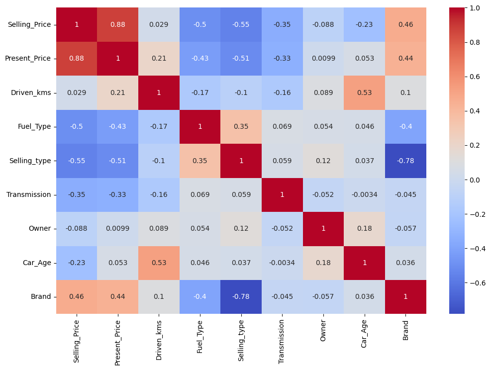
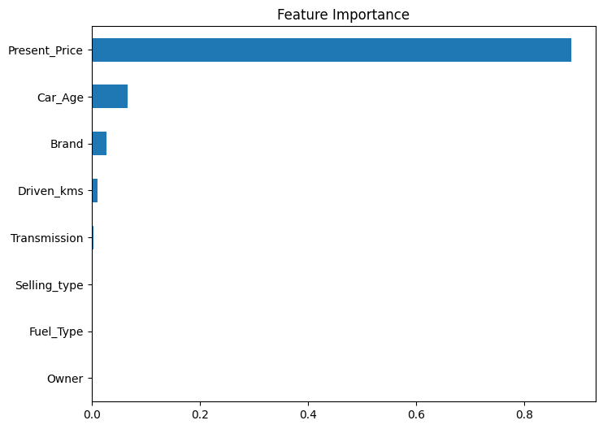

# 🚗 CodeAlpha - Car Price Prediction using Machine Learning


---

# 📌 Project Overview

This project was completed as part of the **CodeAlpha Machine Learning Internship**.

The objective of this project is to predict the selling price of used cars using Machine Learning algorithms. The model analyzes various car-related features such as present price, driven kilometers, fuel type, transmission, ownership history, car age, and brand to estimate an accurate selling price.

The project demonstrates the complete Machine Learning workflow from data preprocessing to model deployment.

---

# 🎯 Objectives

- Analyze the car price dataset.
- Perform data cleaning and preprocessing.
- Explore the dataset using visualizations.
- Engineer meaningful features.
- Train multiple regression models.
- Compare model performance.
- Predict selling prices accurately.
- Save the trained model for future use.

---

# 📂 Dataset Information

| Feature | Description |
|----------|-------------|
| Car_Name | Name of the Car |
| Year | Manufacturing Year |
| Selling_Price | Selling Price (Target Variable) |
| Present_Price | Current Ex-showroom Price |
| Driven_kms | Total Distance Driven |
| Fuel_Type | Petrol / Diesel / CNG |
| Selling_type | Dealer / Individual |
| Transmission | Manual / Automatic |
| Owner | Previous Owners |

---

# ⚙️ Machine Learning Workflow

```
Load Dataset
      │
      ▼
Data Cleaning
      │
      ▼
Feature Engineering
      │
      ▼
Exploratory Data Analysis
      │
      ▼
Encoding
      │
      ▼
Train-Test Split
      │
      ▼
Train Multiple Models
      │
      ▼
Model Evaluation
      │
      ▼
Hyperparameter Tuning
      │
      ▼
Prediction
      │
      ▼
Save Model
```

---

# 🧰 Technologies Used

- Python
- Pandas
- NumPy
- Matplotlib
- Seaborn
- Scikit-Learn
- Joblib
- Google Colab

---

# 🤖 Machine Learning Models

- ✅ Linear Regression
- ✅ Decision Tree Regressor
- ✅ Random Forest Regressor
- ✅ Gradient Boosting Regressor

---

# 📊 Model Evaluation Metrics

The following evaluation metrics were used:

- Mean Absolute Error (MAE)
- Mean Squared Error (MSE)
- Root Mean Squared Error (RMSE)
- R² Score

---

# 🏆 Best Performing Model

**Random Forest Regressor** achieved the best overall performance with the highest prediction accuracy and strongest generalization on unseen data.

---

# 📈 Key Insights

- Present Price is the most influential feature.
- Car Age negatively affects selling price.
- Cars with fewer driven kilometers generally have higher resale value.
- Manual transmission vehicles are more common in the dataset.
- Random Forest outperformed the other regression models.

---

# 📸 Project Visualizations

## Correlation Heatmap


```text
heatmap.png
```

```markdown

```

---

## Feature Importance

```markdown

```

---


---

# 📁 Project Structure

```
CodeAlpha_CarPricePrediction
│
├── Car_Price_Prediction.ipynb
├── car data.csv
├── car_price_prediction.pkl
├── requirements.txt
├── README.md
└── images
      ├── heatmap.png
      ├── feature_importance.png
      ├── actual_vs_predicted.png
      └── distribution.png
```

---

# 🚀 Installation

Clone the repository

```bash
git clone https://github.com/YourUsername/CodeAlpha_CarPricePrediction.git
```

Move into the project directory

```bash
cd CodeAlpha_CarPricePrediction
```

Install dependencies

```bash
pip install -r requirements.txt
```

Run the notebook

```bash
jupyter notebook
```

---

# 💻 Future Scope

- Deploy the model using Streamlit.
- Integrate live car market data.
- Improve accuracy using XGBoost or LightGBM.
- Build a web application for real-time price prediction.

---

# 👨‍💻 Author

**Jamshed Ahmad**

Machine Learning Intern | Data Science Enthusiast

- LinkedIn: *www.linkedin.com/in/jamshed-ahmad007*
- GitHub: *https://github.com/Jamshed-Ahmad*

---

# ⭐ Internship Project

This project was completed as part of the **CodeAlpha Machine Learning Internship Program** and demonstrates practical implementation of supervised machine learning techniques for real-world price prediction.
